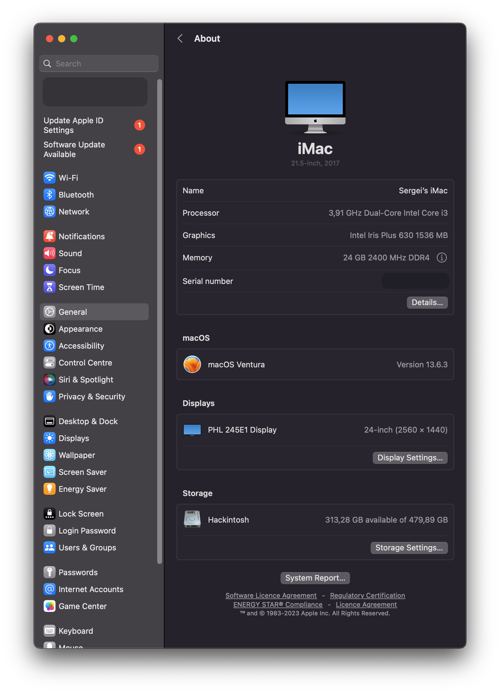
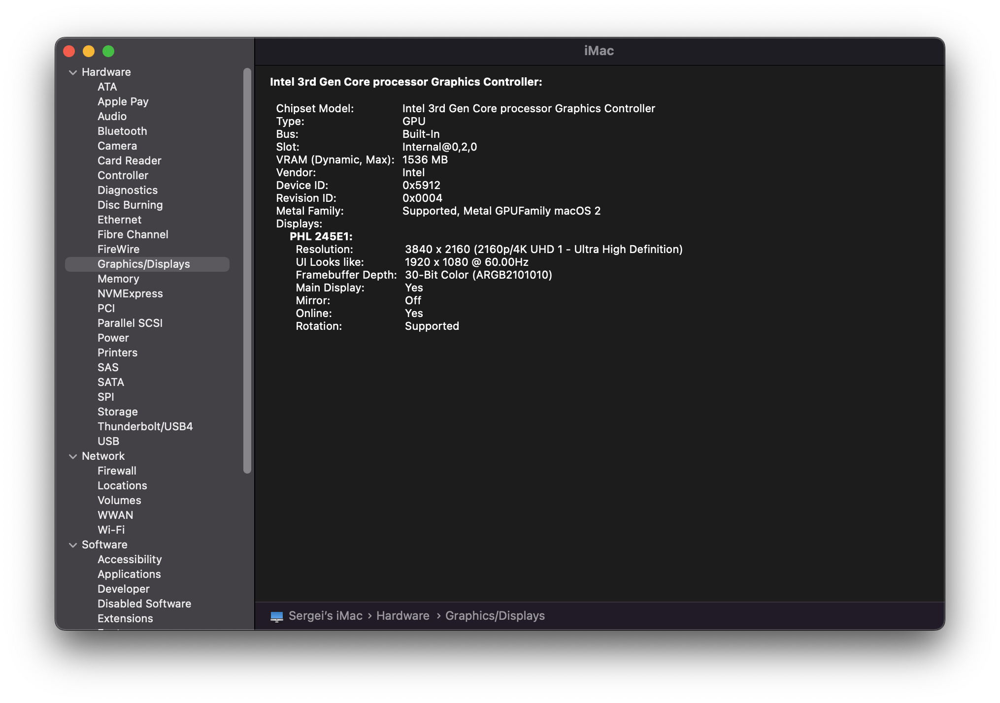
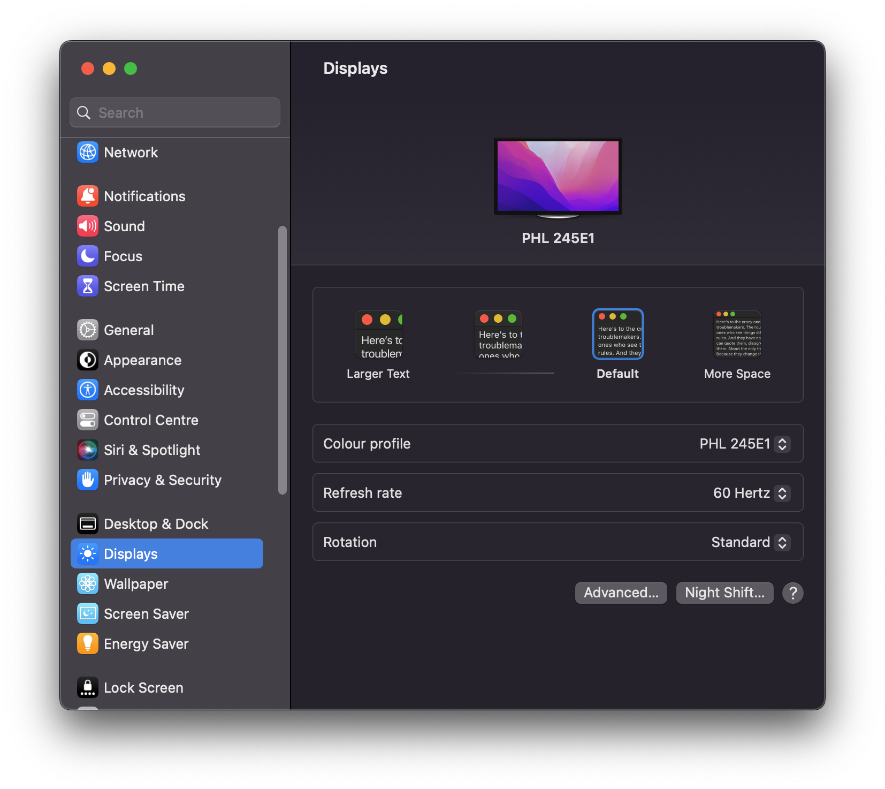

# Hackintosh




## Equipment

| ==Important== | ==Content== |
| ---- | ---- |
| CPU | i3 7100 |
| iGPU | HD Graphics 630 |
| Motherboard | ASUS Prime H270-Plus |
| ==Additional== | ==Content== |
| Display | Philips 245E 1440p |
| Memory | Kingston DDR4 4GBx2 2400 MHz |
| Drive | SSD Kingston A400 500GB |
| Audio | Realtek ALC887 |
| Network | Realtek RTL8111H |

## Content
1. [Gathering Tools](#Gathering_Tools)
  2. [GUI](#GUI)
  3. [CLI](#CLI)
4. [Making USB Installer](#Making_USB_Installer)
5. [Making EFI](#Making_EFI)
  6. [SSDT](#SSDT)
  7. [Kexts](#Kexts)
8. [Post install](#Post_install)
   1. [Programs](#Programs)
   2. [Display](#Display)
   3. [Launchpad](#Launchpad)


## Gathering_Tools
### GUI
- [Hackintool](https://github.com/benbaker76/Hackintool) (for connectors)
	- I selected 0x59120000 Profile-id for display (HDMI)
- [Mist](https://github.com/ninxsoft/Mist) (for downloading dmg)

Whatevergreen profiles [here](https://github.com/acidanthera/WhateverGreen/blob/master/Manual/FAQ.IntelHD.en.md)
### CLI
- [ProperTree](https://github.com/corpnewt/ProperTree)
- [MountEFI](https://github.com/corpnewt/MountEFI)
- [GenSMBIOS](https://github.com/corpnewt/GenSMBIOS)
- [OpenCore v0.9.7](https://github.com/acidanthera/OpenCorePkg/releases)

## Making_USB_Installer
apple site for specific [command](https://support.apple.com/en-us/101578)

Requirements:
- format into MacOS Extended (Journaled)
- size >= 16 GB

## Making_EFI
### SSDT
Prebuilt SSDTs for specific processor: [SSDT](https://dortania.github.io/Getting-Started-With-ACPI/ssdt-methods/ssdt-prebuilt.html#intel-desktop-ssdts)

For Kaby Lake:
- [SSDT-PLUG-DRTNIA](https://github.com/dortania/Getting-Started-With-ACPI/blob/master/extra-files/compiled/SSDT-PLUG-DRTNIA.aml)
- [SSDT-EC-USBX-DESKTOP](https://github.com/dortania/Getting-Started-With-ACPI/blob/master/extra-files/compiled/SSDT-EC-USBX-DESKTOP.aml)

> Place into EFI/OC/ACPI
### Kexts
Gathering Kexts for specific hardware: [Kexts](https://dortania.github.io/OpenCore-Install-Guide/ktext.html#firmware-drivers)

I included this Kexts:
- Lilu.kext
- Whatevergreen.kext
- VirtualSMC.kext
- RealtekRTL8111.kext
- AppleALC.kext
- USBInjectAll.kext
- USBToolBox.kext
- UTBDefault.kext

> Place into EFI/OC/Kexts

## Post_install
### Programs:

- [MonitorControl](https://github.com/MonitorControl/MonitorControl/releases) - for changing display brightness
- [MOS](https://mos.caldis.me) - for smooth scroll
- [OneKeyHiDPI](https://github.com/xzhih/one-key-hidpi) - for HiDPI resolution for display
	- Enable HiDPI option
	- Logo as default
	- For 2056x1440 display
- [gfxutil](https://github.com/acidanthera/gfxutil/releases) - for enabling audio
- [IOReg](https://github.com/khronokernel/IORegistryClone/blob/master/ioreg-302.zip) - for determining working display

I added beautiful ui for opencore boot process following this [instruction](https://dortania.github.io/OpenCore-Post-Install/cosmetic/gui.html)

I enabled audio following this [instruction](https://dortania.github.io/OpenCore-Post-Install/universal/audio.html)

### Display

For HDMI enabling I was following this guides: 

- [Patching Connector Types](https://dortania.github.io/OpenCore-Post-Install/gpu-patching/intel-patching/connector.html)
- [Patching Bus IDs](https://dortania.github.io/OpenCore-Post-Install/gpu-patching/intel-patching/busid.html#parsing-the-framebuffer)
- [General Framebuffer Patching Guide using Hackintool](https://www.tonymacx86.com/threads/guide-general-framebuffer-patching-guide-hdmi-black-screen-problem.269149/)

I have picked the profile-id `0x59120000` (recommended) as my motherboard uses the same ports as Asus Prime H370-Plus (from the last guide):
- Index 1, BusID 0x01, Type DP  
- Index 2, BusID 0x02, Type HDMI (physical port is DVI)  
- Index 3, BusID 0x04, Type HDMI

Default size of screen set to `3840 × 2160`:



DPI option set to `default`:



### Launchpad

For changing the size of the launchpad table I use this commands in terminal:

```shell
defaults write com.apple.dock springboard-columns -int 10
defaults write com.apple.dock springboard-rows -int 7 
killall Dock
```
